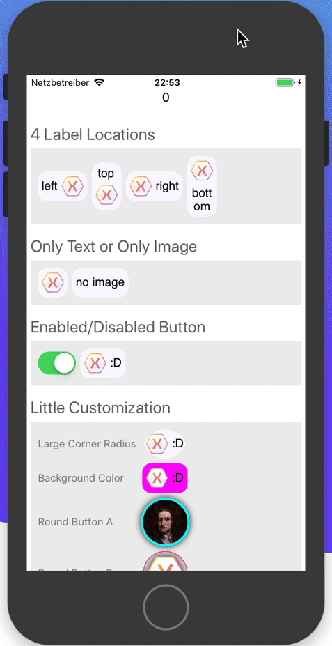

# SimpleImageButton

## Intro
A simple ImageButton for Xamarin.Forms

## Installation
Grab the NuGet package from: https://www.nuget.org/packages/SimpleImageButton/
(or build it yourself)
1. Install it in your .Net Standard project, where your UI lives.
2. Then install the package in any platform-specific projects that you have.
3. Finally, initialize it. This is necessary in order for the PlatformEffect to get loaded and needs to be done once for each platform.

    <details>
    <summary>Init on iOS</summary>
    In the AppDelegate.cs file, in FinishedLaunching(...) add the following call after Forms.Init() and before LoadApplication(new App()):

    ```csharp
    SimpleImageButton.Initializator.Initializator.Init();
    ```
    </details>

    <details>
    <summary>Init on macOS</summary>
    In the AppDelegate.cs file, in DidFinishLaunching(...) add the following call after Forms.Init() and before LoadApplication(new App()):

    ```csharp
    SimpleImageButton.Initializator.Initializator.Init();
    ```
    </details>

    <details>
    <summary>Init on Android</summary>
    In the MainActivity.cs file (or wherever you initialize Xamarin.Forms), in OnCreate(...) add the following call after Forms.Init() and before LoadApplication(new App()):

    ```csharp
    SimpleImageButton.Initializator.Initializator.Init();
    ```
    </details>

    <details>
    <summary>Init on UWP</summary>
    In the MainPage.xaml.cs.cs file, in the MainPage(...) constructor add the following call before the call to this.InitializeComponent();:

    ```csharp
    SimpleImageButton.Initializator.Initializator.Init();
    ```
    </details>

## Prerequisites to compile the library

<details>
<summary>Compile on Windows</summary>
If you use Windows as your development OS then you're in luck because you can pretty much build everything, without modifying the code.

In the Visual Studio Installer ensure that you have the following workloads checked:
* .Net desktop development
* Universal Windows Platform development
* Mobile development with .Net
* .NET Core cross-platform development

Also in the Visual Studio Installer, switch to the Individual Components tab and scroll to the bottm. Check the 4 entries for Windows 10 SDK (10.0.16299). 

Hint: If you modify the SimpleImageButton.csproj to reference another version of UAP than 10.0.16299 then you would probably need to also come back to the Visual Studio Installer and check that specific version.

That's it!
</details>


## Fun fact
I built this for myself, thinking I could whip something together in 10 minutes and make a button out of it using the VisualStateManager. 

It turned out that Xamarin.Forms' GestureRecognizers are still pretty lame, after so many years, so I had to use PlatformEffects. 
This complicated matters quite a lot, as now I had to add platform specific implementations of my Effect (in code you'll find it as TouchAndPressEffect).

Because at this point I already decided to share the code as a NuGet package there was the issue that I will have to produce one .Net Standard library(with most of the code) and at least 4 platform-specific libraries (with the PlatformEffects).

SDK Style and Multi-Targeted project to the rescue: long story short this is now a multi-target project, making your life easier and mine significantly more complex. The things I do for you :D

## Here's the sample project showing off the SimpleImageButton
